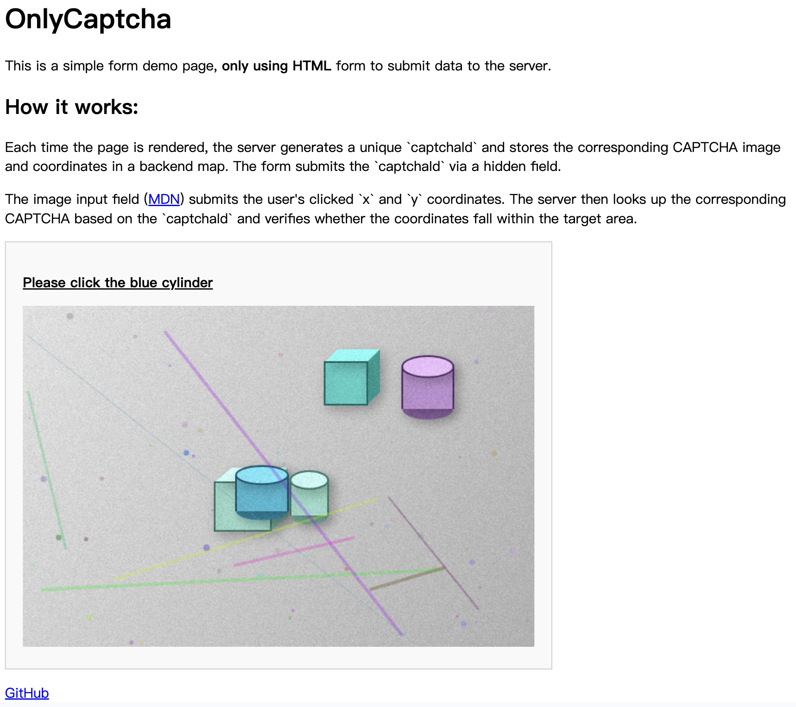

## OnlyCaptcha



OnlyCaptcha is a minimal server-side CAPTCHA demo built with Elysia and Bun.

It generates image-based CAPTCHAs consisting of several objects and verifies a user's click coordinates on the image.

Key ideas
- Server generates a unique `captchaId` and an image with a target coordinate for each page render.
- The page includes a hidden `captchaId` field in a native HTML form and an `<input type="image">` element. When the user clicks the image, the browser submits the form including `x` and `y` (the click coordinates) and the `captchaId`.
- The server looks up the stored CAPTCHA by `captchaId` and verifies the submitted coordinates against the target.

Features
- Generates PNG CAPTCHA images server-side using canvas utilities.
- Short-lived server-side Map to store captchas (entries auto-expire after 5 minutes).
- Works with native HTML form submission — no client-side JS required for basic flow.

Prerequisites
- Bun or another Node-compatible runtime.

Installation

```bash
bun install
```

Run

```bash
bun run src/index.ts
```

Endpoints
- `GET /` — renders the demo page and returns a CAPTCHA image with a hidden `captchaId` in the form.
- `POST /submit` — expects `application/x-www-form-urlencoded` with fields `captchaId`, and the coordinates `x` and `y` (submitted automatically by `<input type="image">`). Server responds with verification result.

Notes
- The server-side Map that stores captchas automatically deletes each entry after 5 minutes to avoid memory growth.
- Native HTML forms cannot set custom request headers; use a hidden form field to transmit `captchaId`. To use headers, submit via fetch/XHR from the client.

